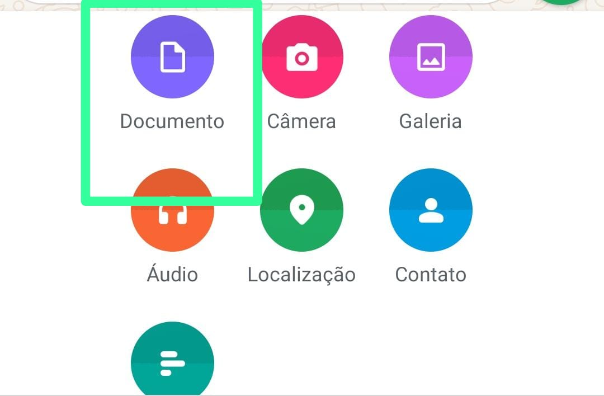

# wwebjs-exifparser-excel
Este é um bot que recebe fotos em documento para capturar `metadados exifs` para depois retorná-los em relatorio .xlsx<br/>

### Por que?
 desta maneira não precisamos mais que o client envie duas mensagens contendo imagem e posteriormente uma localização, resolvemos tudo de uma vez só, além disso os metadados exifs permitem que obtenhamos latitude e longitude do remetente da mensagem, algo muito bom se quisermos controlar algo ou alguém!<br/>
 Para funcionar pegandos todos os dados voce deve enviar a foto como documento :point_down:<br/>



> [!IMPORTANT]
> Se voce enviar como uma foto da galeria ele não capturará os metadados, mas funcionará normalmente, além disso voce deve está com o modo exif habilitado em seu celular!

### Instalação
```
git clone https://github.com/rafaelssucupira/wwebjs-exifparser-excel.git
```

### Começando
Envie uma foto ou uma foto tirada pela camera do celular e depois envie **relatorio** para retornar o .xlsx!
Podemos executa-los de duas formas : em um grupo ou no privado

`Privado :point_down:`
```
npm run start-private
```
`Grupo :point_down:`
```
npm run start-group
```

### Saída
Produzirá um arquivo .xlsx, algo como :
- Data/Hora Foto
- Recebido em
- Número
- Nome
- Descrição		
- Coordenadas										
<br/>


